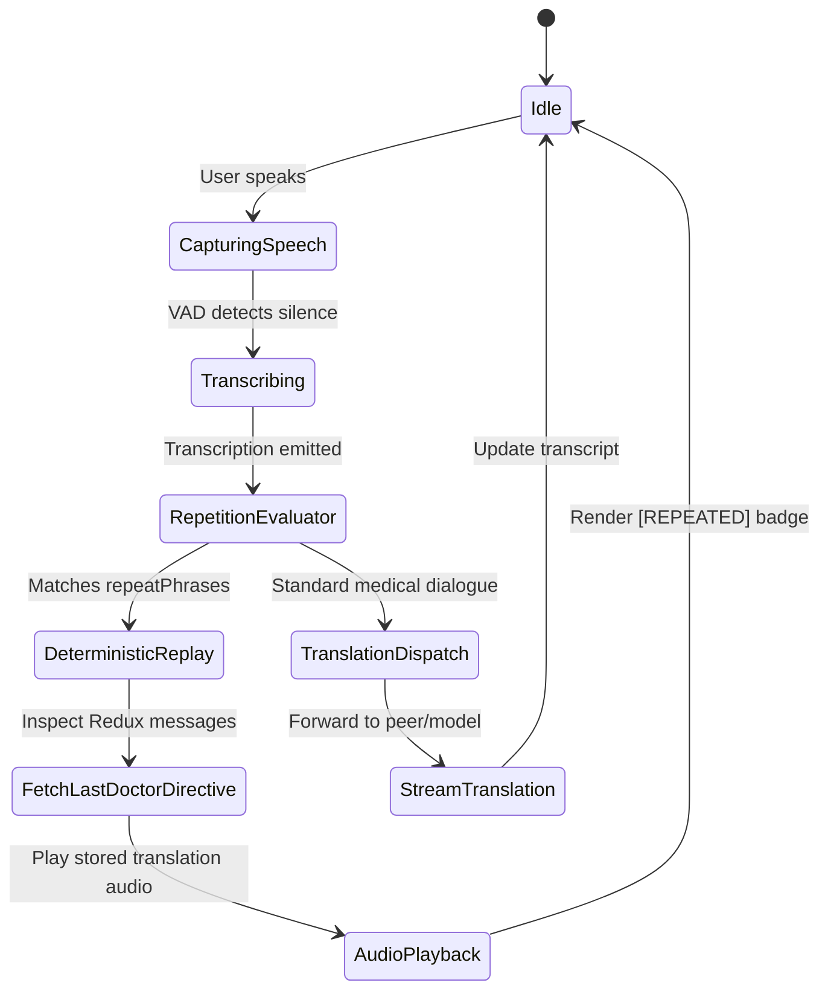

# System Architecture & Technical Design

How the Real-Time Medical Interpreter fits together, and why it is engineered this way.

The design principles and trade-off arguments live in [`docs/adr/`](adr/README.md). This document serves as the high-level system blueprint.

---

## 1. High-Level System Architecture

The application adopts a **hexagonal / ports-and-adapters** separation between the browser runtime, the backend coordination layer, and external AI services.

```
                      +-------------------------------------------------+
                      |               CLIENT (Browser SPA)              |
                      |  React 18 · Redux Toolkit · WebRTC PeerConnection|
                      |  AudioContext Pipeline · Web Speech API Synthesizer |
                      +-------------------+-----------------------------+
                                          |
                        Signaling & Auth  |  WebRTC Media & Data Stream
                        (HTTP / JSON)     |  (PCM16 24kHz / oai-events)
                                          |
                      +-------------------v---+     +-------------------+
                      |   BACKEND SERVER      |     |  OPENAI REALTIME  |
                      | Express · Node.js 20  |     |  API GATEWAY      |
                      | Resilient Repository  |     | (gpt-4o-realtime) |
                      +-----------+-----------+     +---------^---------+
                                  |                           |
                 +----------------+----------------+          | Direct Media
                 |                                 |          | (PeerConnection)
       +---------v---------+             +---------v-------+  |
       |  MongoDB (Prod)   |             | In-Memory Store |  |
       | Transcripts & EMR |             |  (Zero Config)  |  |
       +-------------------+             +-----------------+--+
```

### Dependency Inversion & Isolation
1. **Zero Secret Leakage:** The client **never** receives long-lived OpenAI API credentials. The server acts as a credential broker, issuing short-lived ephemeral session tokens (TTL: 60s) via `POST /api/session/ephemeral-key`.
2. **Direct Peer Streaming:** Once the ephemeral key is negotiated, the client negotiates an SDP offer/answer directly with `https://api.openai.com/v1/realtime`, eliminating proxy audio latency through the Node backend.
3. **Resilient Persistence Decoupling:** Storage is abstracted behind a `ConversationRepository` contract. If MongoDB is unreachable, the system automatically falls back to an `InMemoryConversationRepository`, logging a warning without halting execution.

---

## 2. WebRTC Audio & Signaling Pipeline

```
  Doctor / Patient Speech
            │
            ▼
┌───────────────────────┐
│ navigator.mediaDevices│ ──> getUserMedia({ audio: true })
└───────────┬───────────┘
            │
            ▼
┌───────────────────────┐      Offer (SDP) + Ephemeral Key
│   RTCPeerConnection   │ ──────────────────────────────────┐
└───────────┬───────────┘                                   ▼
            │                                     ┌──────────────────┐
            │ Remote Audio Track (ontrack)        │ OpenAI Realtime  │
            ├──────────────────────────────────── │ Gateway          │
            │                                     └─────────┬────────┘
            ▼                                               │
┌───────────────────────┐      DataChannel ("oai-events")   │
│  <audio> playback /   │ ◄─────────────────────────────────┘
│  Web Audio Analyzer   │      • conversation.item.input_audio_transcription.completed
└───────────────────────┘      • response.audio_transcript.done
                               • response.audio.delta
```

### The WebRTC Handshake Lifecycle
1. **Local Initialization:** The client acquires local microphone audio and invokes `peerConnection.addTrack(stream.getAudioTracks()[0])`.
2. **Data Channel Creation:** The client instantiates a WebRTC data channel labeled `"oai-events"`.
3. **SDP Offer Creation:** `peerConnection.createOffer()` generates a local SDP description containing media codecs and candidate descriptors.
4. **Session Negotiation:** The local SDP offer is sent directly to `https://api.openai.com/v1/realtime?model=gpt-4o-realtime-preview-2024-12-17` with the ephemeral Bearer token in the `Authorization` header.
5. **SDP Answer Installation:** The OpenAI Realtime gateway returns an SDP answer, which is installed via `peerConnection.setRemoteDescription(answer)`.
6. **Data Channel Configuration (`session.update`):** Once `dataChannel.onopen` fires, the client emits a `session.update` payload strictly configuring the model into pure interpretation mode:

```json
{
  "type": "session.update",
  "session": {
    "modalities": ["text", "audio"],
    "instructions": "You are a PURE MEDICAL TRANSLATOR. Translate speech from English to Spanish. Maintain medical precision. Do not respond to questions or provide medical advice.",
    "voice": "alloy",
    "input_audio_format": "pcm16",
    "output_audio_format": "pcm16",
    "turn_detection": {
      "type": "server_vad",
      "threshold": 0.5,
      "prefix_padding_ms": 300,
      "silence_duration_ms": 500,
      "create_response": true
    }
  }
}
```

---

## 3. Repetition & Clarification State Machine

In critical clinical discussions, patients frequently request clarification (`"Repeat that please"` / `"¿Puede repetir?"`). Routing this request back through an LLM introduces hallucination risk. 

The application implements a **deterministic state machine**:



---

## 4. Layered Server Architecture

The server adheres to strict separation of concerns:

```
server/src/
├── config/             Validated environment configuration & defaults
├── controllers/        HTTP request handlers, response shaping, status codes
├── services/           Core business logic (OpenAI session negotiation, translation)
├── repositories/       Storage interfaces (MongoConversationRepository & InMemoryFallback)
├── middleware/         RFC-7807 error formatting, request logging, rate-limiting
└── routes/             Route definitions with dual mounting (API v1 + backward-compatible)
```

### Graceful Storage Degradation
```javascript
// Storage Factory Pattern
function initializeRepository() {
  if (config.MONGODB_URI) {
    try {
      const repo = new MongoConversationRepository(config.MONGODB_URI);
      await repo.connect();
      return repo;
    } catch (err) {
      logger.warn('MongoDB unreachable. Falling back to InMemoryConversationRepository');
    }
  }
  return new InMemoryConversationRepository();
}
```

---

## 5. Post-Encounter Clinical Entity Extraction

Upon clicking **"End Conversation & Generate Summary"**, the client executes deterministic clinical parsing on the complete encounter transcript:

```
Transcript Stream
       │
       ├──> Regex Classifier 1: Follow-Up & Scheduling
       │    (Matches: follow-up, cita, próxima visita, return visit, schedule, 1 week...)
       │
       ├──> Regex Classifier 2: Laboratory & Diagnostics
       │    (Matches: blood test, análisis de sangre, X-ray, radiografía, CT scan, urine...)
       │
       ├──> Regex Classifier 3: Medication & Prescriptions
       │    (Matches: prescribe, receta, dosage, antibiotics, mg, daily...)
       │
       └──> Structural Formatter
            (Aggregates exchange volume, turns, repetition telemetry, and markdown brief)
```

The resulting clinical summary is presented in an interactive card and made available for instant download in standard Clinical Markdown format.

---

## 6. Security Considerations

1. **Ephemeral Credential Scoping:** Client sessions acquire single-use tokens expiring in 60 seconds.
2. **Access Token Gate:** `APP_ACCESS_TOKEN` guards session minting, translation, and transcript routes (`middleware/accessToken.js`, constant-time comparison). Live mode fails closed: the server will not start without a token. A shared code, not per-user identity.
3. **CORS Allow-List:** `middleware/cors.js` grants only `CORS_ORIGINS` and same-origin requests.
4. **Rate Limiting:** `middleware/rateLimit.js`, a per-client fixed window, runs before authentication so token guessing is throttled. In-memory, single-process.
5. **Zero Audio Retention on Server:** Audio media flows directly over peer-to-peer WebRTC encryption (DTLS/SRTP) between browser and OpenAI gateway. No voice recordings touch the application backend.
6. **Redactable Transcripts:** Transcript persistence is opt-in; local mock mode stores nothing in non-volatile storage.

Not HIPAA-compliant as-is: real patient data would also need per-user authentication, a BAA with the model provider, audit logging, and encryption at rest for transcripts.
