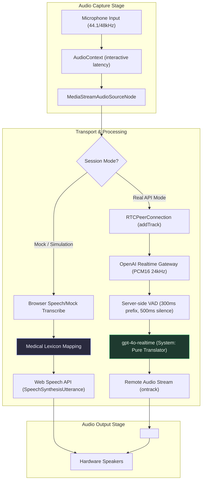

# Audio Pipeline & Data Flow

Detailed audio stream ingestion, WebRTC encoding, and local speech synthesis fallback.

```mermaid
flowchart TD
    subgraph Ingestion ["Audio Capture Stage"]
        Mic["Microphone Input (44.1/48kHz)"] --> AudioCtx["AudioContext (interactive latency)"]
        AudioCtx --> StreamTrack["MediaStreamAudioSourceNode"]
    end

    subgraph Transport ["Transport & Processing"]
        StreamTrack --> ModeDecision{"Session Mode?"}
        ModeDecision -- "Real API Mode" --> PeerTrack["RTCPeerConnection (addTrack)"]
        PeerTrack --> RemoteGateway["OpenAI Realtime Gateway (PCM16 24kHz)"]
        RemoteGateway --> RemoteVAD["Server-side VAD (300ms prefix, 500ms silence)"]
        RemoteVAD --> Translator["gpt-4o-realtime (System: Pure Translator)"]
        Translator --> AudioDelta["Remote Audio Stream (ontrack)"]
        
        ModeDecision -- "Mock / Simulation" --> SpeechRec["Browser Speech/Mock Transcribe"]
        SpeechRec --> MockDict["Medical Lexicon Mapping"]
        MockDict --> WebSpeech["Web Speech API (SpeechSynthesisUtterance)"]
    end

    subgraph Playback ["Audio Output Stage"]
        AudioDelta --> HTMLAudio["<audio> element (remote stream)"]
        WebSpeech --> Speaker["Hardware Speakers"]
        HTMLAudio --> Speaker
    end

    style Translator fill:#1e3a2f,stroke:#4ade80,color:#e8f5e9
    style MockDict fill:#2a2a3e,stroke:#818cf8,color:#eef
```
