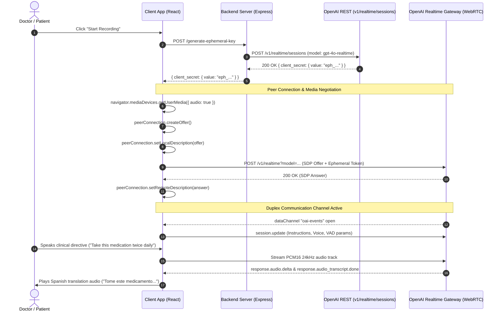

# WebRTC Handshake & Session Sequence

Sequence diagram showing ephemeral token issuance, SDP offer/answer exchange, and data channel configuration.

```mermaid
sequenceDiagram
    autonumber
    actor Physician as Doctor / Patient
    participant Browser as Client App (React)
    participant Server as Backend Server (Express)
    participant OpenAI_API as OpenAI REST (v1/realtime/sessions)
    participant OpenAI_RTC as OpenAI Realtime Gateway (WebRTC)

    Physician->>Browser: Click "Start Recording"
    Browser->>Server: POST /generate-ephemeral-key
    Server->>OpenAI_API: POST /v1/realtime/sessions (model: gpt-4o-realtime)
    OpenAI_API-->>Server: 200 OK { client_secret: { value: "eph_..." } }
    Server-->>Browser: { client_secret: { value: "eph_..." } }

    Note over Browser,OpenAI_RTC: Peer Connection & Media Negotiation
    Browser->>Browser: navigator.mediaDevices.getUserMedia({ audio: true })
    Browser->>Browser: peerConnection.createOffer()
    Browser->>Browser: peerConnection.setLocalDescription(offer)
    Browser->>OpenAI_RTC: POST /v1/realtime?model=... (SDP Offer + Ephemeral Token)
    OpenAI_RTC-->>Browser: 200 OK (SDP Answer)
    Browser->>Browser: peerConnection.setRemoteDescription(answer)

    Note over Browser,OpenAI_RTC: Duplex Communication Channel Active
    OpenAI_RTC-->>Browser: dataChannel "oai-events" open
    Browser->>OpenAI_RTC: session.update (Instructions, Voice, VAD params)
    Physician->>Browser: Speaks clinical directive ("Take this medication twice daily")
    Browser->>OpenAI_RTC: Stream PCM16 24kHz audio track
    OpenAI_RTC-->>Browser: response.audio.delta & response.audio_transcript.done
    Browser->>Physician: Plays Spanish translation audio ("Tome este medicamento...")
```
